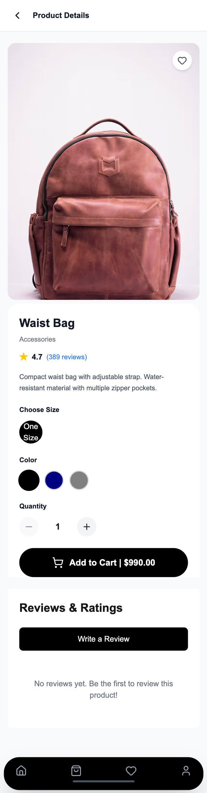
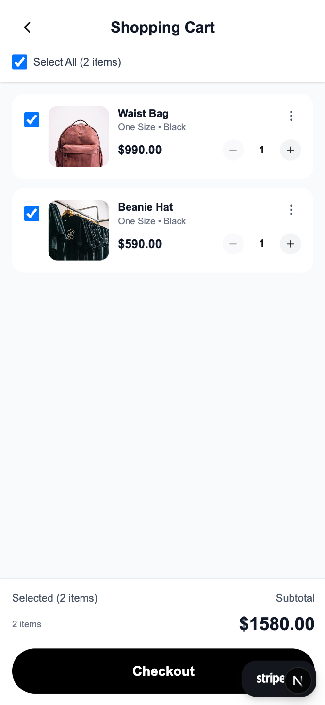
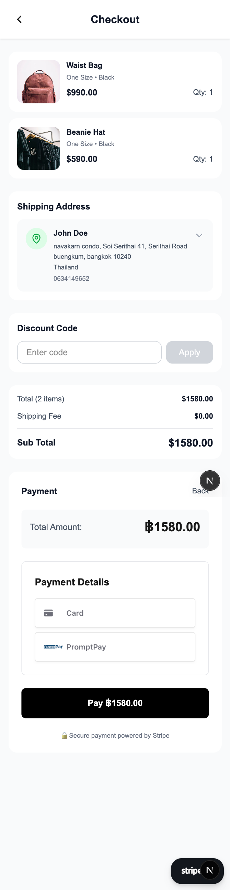
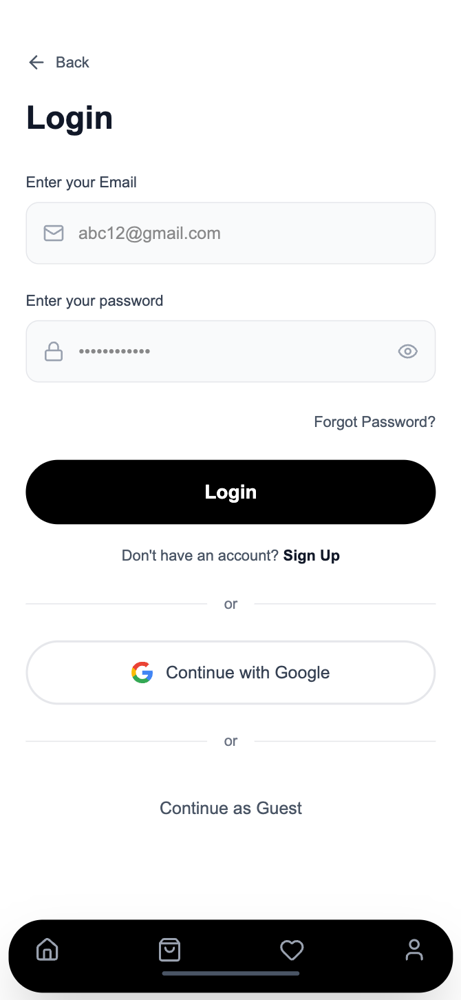
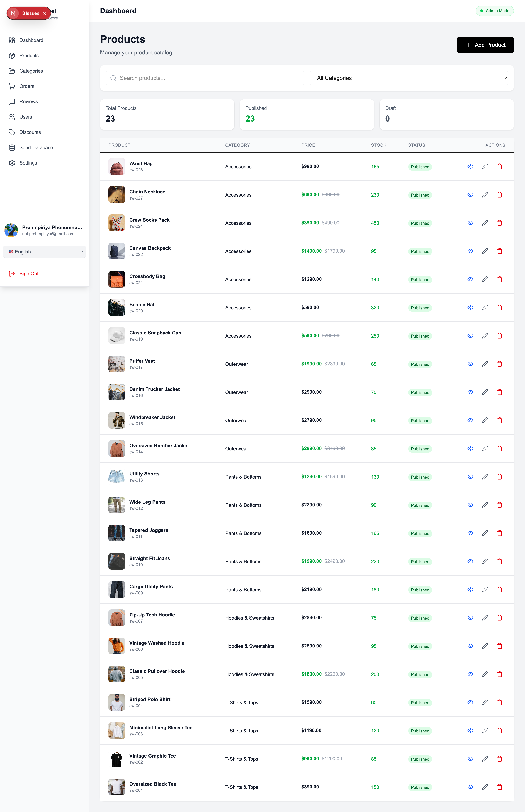

# 🛍️ Modern E-Commerce Web Application

A full-stack, production-ready e-commerce platform built with Next.js 16, TypeScript, Firebase, and Stripe. This application showcases modern web development practices with a complete shopping experience for customers and a comprehensive management system for administrators.

<div align="center">


[Live Demo](#) • [Documentation](#) • [Report Bug](#)

</div>

---

## 📸 Screenshots

### 🛒 Customer Experience

<div align="center">

#### Mobile Views

<table>
  <tr>
    <td align="center" width="33%">
      
      <br />
      <b>Home Page</b>
      <br />
      <sub>Browse products with filters</sub>
    </td>
    <td align="center" width="33%">
      
      <br />
      <b>Product Detail</b>
      <br />
      <sub>View details, reviews & ratings</sub>
    </td>
    <td align="center" width="33%">
      
      <br />
      <b>Shopping Cart</b>
      <br />
      <sub>Manage cart items</sub>
    </td>
  </tr>
  <tr>
    <td align="center" width="33%">
      
      <br />
      <b>Checkout</b>
      <br />
      <sub>Secure payment with Stripe</sub>
    </td>
    <td align="center" width="33%">
      
      <br />
      <b>Authentication</b>
      <br />
      <sub>Email/Password & Google OAuth</sub>
    </td>
    <td align="center" width="33%">
    </td>
  </tr>
</table>

</div>

### 👨‍💼 Admin Dashboard

<div align="center">

<table>
  <tr>
    <td align="center">
      
      <br />
      <b>Product Management</b>
      <br />
      <sub>Complete CRUD operations with image upload</sub>
    </td>
  </tr>
  <tr>
    <td align="center">
      
      <br />
      <b>Customer Product View</b>
      <br />
      <sub>Beautiful product display with filters and search</sub>
    </td>
  </tr>
</table>

</div>

---

## ✨ Features

### 🛒 Customer Features

<table>
  <tr>
    <td width="50%">

#### Shopping Experience
- 🔐 **Authentication System**
  - Email/Password registration & login
  - Google OAuth integration
  - Password reset functionality
  - Session management

- 🛒 **Smart Shopping Cart**
  - Real-time cart synchronization
  - Persistent storage (Firestore + localStorage)
  - Quantity management
  - Price calculations with discounts

- ❤️ **Wishlist**
  - Save favorite products
  - Quick add to cart from wishlist
  - Sync across devices

    </td>
    <td width="50%">

#### Checkout & Orders
- 💳 **Secure Checkout**
  - Stripe payment integration
  - Multiple payment methods
  - Address management
  - Order summary

- 🎟️ **Discount System**
  - Promo code validation
  - Percentage & fixed amount discounts
  - Minimum purchase requirements
  - Usage limits

- 📦 **Order Management**
  - Order history tracking
  - Real-time status updates
  - Order details view
  - Re-order functionality

    </td>
  </tr>
</table>

<table>
  <tr>
    <td width="50%">

#### Product Experience
- ⭐ **Reviews & Ratings**
  - Write and edit reviews
  - Star rating system
  - Helpful vote functionality
  - Image uploads in reviews
  - Average rating calculation

- 🔍 **Advanced Search & Filters**
  - Category filtering
  - Price range slider
  - Sorting options
  - Stock availability filter

    </td>
    <td width="50%">

#### Personalization
- 👤 **User Profile**
  - Profile management
  - Multiple shipping addresses
  - Payment method storage
  - Order history

- 🌐 **Multi-language Support**
  - English (en)
  - Thai (th)
  - Chinese (zh)
  - Japanese (ja)
  - Seamless language switching

- 💱 **Multi-currency**
  - USD, THB, EUR, GBP, JPY
  - Automatic price conversion
  - Currency-specific formatting

    </td>
  </tr>
</table>

### 👨‍💼 Admin Features

<table>
  <tr>
    <td width="50%">

#### Dashboard & Analytics
- 📊 **Comprehensive Dashboard**
  - Total revenue tracking
  - Order statistics
  - User metrics
  - Recent orders overview

- 📦 **Product Management**
  - Create, read, update, delete products
  - Bulk image upload
  - Inventory management
  - Product variants (sizes, colors)
  - Published/Draft status

- 🗂️ **Category Management**
  - Category CRUD operations
  - SEO-friendly slugs
  - Product count per category
  - Active/Inactive status

    </td>
    <td width="50%">

#### Operations
- 📋 **Order Management**
  - View all orders
  - Update order status
  - Customer information
  - Payment details
  - Shipping address

- 💬 **Review Moderation**
  - View all product reviews
  - Delete inappropriate content
  - Rating statistics
  - Review breakdown by stars

- 👥 **User Management**
  - View all users
  - Role management (admin/customer)
  - User activity tracking
  - Account activation/deactivation

- 🎟️ **Discount Management**
  - Create discount codes
  - Set validity periods
  - Usage limits
  - Minimum purchase amounts
  - Maximum discount caps

    </td>
  </tr>
</table>

---

## 🚀 Tech Stack

### Frontend
- **Framework**: Next.js 16 (App Router with Server Components)
- **Language**: TypeScript 5.0
- **Styling**: Tailwind CSS 3.0
- **UI Components**: Custom components with Lucide React icons
- **Internationalization**: next-intl
- **Image Optimization**: Next.js Image with WebP/AVIF support

### Backend & Services
- **Authentication**: Firebase Auth
- **Database**: Cloud Firestore (NoSQL)
- **File Storage**: Firebase Storage
- **Payment Processing**: Stripe Payment Intents API
- **Security**: Firestore Security Rules with role-based access

### State Management
- **Global State**: React Context API
- **Local State**: React Hooks (useState, useEffect, useReducer)
- **Persistence**: Firestore + localStorage sync

### Development Tools
- **Build Tool**: Turbopack (Next.js 16)
- **Linting**: ESLint
- **Package Manager**: npm
- **Version Control**: Git

### Deployment & Hosting
- **Hosting**: Vercel (Edge Network)
- **CI/CD**: Automatic deployment from GitHub
- **Environment**: Production & Preview environments

---

## 📋 Prerequisites

Before you begin, ensure you have the following installed:

- **Node.js** 18.0 or higher
- **npm** or **yarn** package manager
- **Firebase** account ([Sign up here](https://firebase.google.com/))
- **Stripe** account ([Sign up here](https://stripe.com/))
- **Git** for version control

---

## 🛠️ Installation & Setup

### 1. Clone the Repository

```bash
git clone <your-repository-url>
cd ecommerce-webapp
```

### 2. Install Dependencies

```bash
npm install
```

### 3. Environment Configuration

Create a `.env.local` file in the root directory:

```bash
cp .env.example .env.local
```

Update `.env.local` with your credentials:

```env
# Firebase Configuration
NEXT_PUBLIC_FIREBASE_API_KEY=your_firebase_api_key
NEXT_PUBLIC_FIREBASE_AUTH_DOMAIN=your_project_id.firebaseapp.com
NEXT_PUBLIC_FIREBASE_PROJECT_ID=your_project_id
NEXT_PUBLIC_FIREBASE_STORAGE_BUCKET=your_project_id.appspot.com
NEXT_PUBLIC_FIREBASE_MESSAGING_SENDER_ID=your_messaging_sender_id
NEXT_PUBLIC_FIREBASE_APP_ID=your_app_id

# Stripe Configuration
NEXT_PUBLIC_STRIPE_PUBLISHABLE_KEY=pk_test_your_publishable_key
STRIPE_SECRET_KEY=sk_test_your_secret_key
STRIPE_WEBHOOK_SECRET=whsec_your_webhook_secret

# Base URL (for production deployment)
NEXT_PUBLIC_BASE_URL=http://localhost:3000
```

### 4. Firebase Setup

#### 4.1 Create Firebase Project

1. Go to [Firebase Console](https://console.firebase.google.com/)
2. Click "Add Project" and follow the wizard
3. Register your web app to get configuration

#### 4.2 Enable Authentication

1. Navigate to **Authentication** → **Sign-in method**
2. Enable **Email/Password** provider
3. Enable **Google** provider
4. Add authorized domains (including localhost for development)

#### 4.3 Create Firestore Database

1. Navigate to **Firestore Database**
2. Click "Create Database"
3. Choose **Start in production mode** (we'll add security rules next)
4. Select your preferred region

#### 4.4 Deploy Security Rules

```bash
# Install Firebase CLI if not already installed
npm install -g firebase-tools

# Login to Firebase
firebase login

# Initialize Firebase (if not already done)
firebase init firestore

# Deploy security rules
firebase deploy --only firestore:rules
```

#### 4.5 Set up Firebase Storage

1. Navigate to **Storage** in Firebase Console
2. Click "Get Started"
3. Choose **Start in production mode**
4. Security rules for Storage will be deployed with Firestore rules

### 5. Stripe Setup

#### 5.1 Get API Keys

1. Go to [Stripe Dashboard](https://dashboard.stripe.com/)
2. Navigate to **Developers** → **API keys**
3. Copy your **Publishable key** and **Secret key**
4. Use **Test mode** keys for development

#### 5.2 Configure Webhook (Optional for Production)

1. Navigate to **Developers** → **Webhooks**
2. Add endpoint: `https://your-domain.com/api/webhooks/stripe`
3. Select events to listen for
4. Copy the webhook secret

### 6. Run Development Server

```bash
npm run dev
```

Open [http://localhost:3000](http://localhost:3000) to see your application.

---

## 📁 Project Structure

```
ecommerce-webapp/
├── app/                          # Next.js 16 App Router
│   ├── [locale]/                # Internationalized routes
│   │   ├── admin/              # Admin dashboard pages
│   │   │   ├── page.tsx        # Dashboard overview
│   │   │   ├── products/       # Product management
│   │   │   ├── categories/     # Category management
│   │   │   ├── orders/         # Order management
│   │   │   ├── reviews/        # Review moderation
│   │   │   ├── users/          # User management
│   │   │   └── discounts/      # Discount code management
│   │   ├── products/           # Customer product pages
│   │   │   ├── page.tsx        # Product listing
│   │   │   └── [productId]/    # Product detail
│   │   ├── cart/               # Shopping cart
│   │   ├── checkout/           # Checkout flow
│   │   ├── account/            # User account pages
│   │   │   ├── orders/         # Order history
│   │   │   ├── addresses/      # Address management
│   │   │   └── settings/       # User settings
│   │   ├── login/              # Login page
│   │   ├── register/           # Registration page
│   │   └── forgot-password/    # Password reset
│   ├── api/                    # API routes
│   │   ├── create-payment-intent/  # Stripe payment
│   │   └── webhooks/           # Webhook handlers
│   ├── layout.tsx              # Root layout
│   └── globals.css             # Global styles
│
├── components/                  # React components
│   ├── admin/                  # Admin-specific components
│   │   ├── AdminLayout.tsx     # Admin layout wrapper
│   │   └── ...                 # Other admin components
│   ├── layout/                 # Layout components
│   │   ├── Header.tsx          # Site header
│   │   ├── Footer.tsx          # Site footer
│   │   └── BottomNav.tsx       # Mobile bottom navigation
│   ├── checkout/               # Checkout components
│   │   └── StripePaymentForm.tsx
│   ├── ErrorBoundary.tsx       # Error boundary component
│   └── ...                     # Other reusable components
│
├── context/                     # React Context providers
│   ├── AuthContext.tsx         # Authentication state
│   ├── CartContext.tsx         # Shopping cart state
│   ├── WishlistContext.tsx     # Wishlist state
│   ├── ProductContext.tsx      # Product data
│   ├── CategoryContext.tsx     # Category data
│   ├── OrderContext.tsx        # Order management
│   ├── AddressContext.tsx      # Address management
│   ├── DiscountContext.tsx     # Discount codes
│   ├── ReviewContext.tsx       # Product reviews
│   ├── SettingsContext.tsx     # User settings
│   └── StoreSettingsContext.tsx # Store configuration
│
├── hooks/                       # Custom React hooks
│   └── ...                     # Custom hooks
│
├── lib/                         # Utility functions
│   ├── firebase.ts             # Firebase configuration
│   └── ...                     # Other utilities
│
├── types/                       # TypeScript type definitions
│   └── index.ts                # Type definitions
│
├── messages/                    # i18n translation files
│   ├── en.json                 # English translations
│   ├── th.json                 # Thai translations
│   ├── zh.json                 # Chinese translations
│   └── ja.json                 # Japanese translations
│
├── public/                      # Static assets
│   ├── images/                 # Images
│   └── ...                     # Other static files
│
├── .docs/                       # Documentation & screenshots
│   ├── screenshots/            # App screenshots
│   └── guides/                 # Setup guides
│
├── firestore.rules             # Firestore security rules
├── i18n.ts                     # i18n configuration
├── next.config.ts              # Next.js configuration
├── tailwind.config.ts          # Tailwind CSS configuration
├── tsconfig.json               # TypeScript configuration
└── README.md                   # This file
```

---

## 🔐 Admin Access

To access the admin dashboard:

### Method 1: Using Firebase Console

1. Register a new account through the app
2. Go to [Firebase Console](https://console.firebase.google.com/)
3. Navigate to **Firestore Database**
4. Find your user document in the `users` collection
5. Edit the document and set `role: "admin"`
6. Sign out and sign back in
7. Access admin dashboard at `/admin`

### Method 2: Using Firestore Direct Edit

```javascript
// In Firestore console, run this query:
// Collection: users
// Document ID: <your-user-id>
// Update field: role = "admin"
```

### Admin Features Access

Once you have admin access, you can:
- Access admin dashboard at `/[locale]/admin`
- Manage all products, categories, orders, users
- Moderate reviews
- Create and manage discount codes
- View analytics and statistics

---

## 🧪 Testing Guide

### Test Accounts

#### Customer Account
1. Click "Register" or "Sign Up"
2. Use any email address
3. Create password (min 6 characters)
4. Or use Google OAuth

#### Admin Account
Follow the [Admin Access](#-admin-access) steps above

---

### Test Payment Cards (Stripe Test Mode)

| Card Number | Scenario | CVV | Expiry |
|------------|----------|-----|--------|
| `4242 4242 4242 4242` | ✅ Success | Any 3 digits | Any future date |
| `4000 0000 0000 0002` | ❌ Declined | Any 3 digits | Any future date |
| `4000 0000 0000 9995` | ❌ Insufficient Funds | Any 3 digits | Any future date |
| `4000 0000 0000 0069` | ⏰ Expired Card | Any 3 digits | Any past date |

More test cards: [Stripe Testing Documentation](https://stripe.com/docs/testing)

---

### Test Discount Codes

Create discount codes in the admin panel:

#### Sample Discount Codes to Create:

1. **WELCOME10**
   - Type: Percentage
   - Value: 10%
   - Minimum: None
   - Usage: Unlimited

2. **SAVE50**
   - Type: Fixed Amount
   - Value: $50
   - Minimum: $200
   - Usage: 100

3. **FREESHIP**
   - Type: Fixed Amount
   - Value: $10
   - Minimum: $100
   - Usage: Unlimited

---

### Testing Workflow

#### Customer Flow:
1. ✅ Browse products on home page
2. ✅ Filter by category/price
3. ✅ View product details
4. ✅ Add items to cart
5. ✅ Update cart quantities
6. ✅ Apply discount code
7. ✅ Proceed to checkout
8. ✅ Add shipping address
9. ✅ Complete payment with test card
10. ✅ View order confirmation
11. ✅ Check order history

#### Admin Flow:
1. ✅ Login as admin
2. ✅ View dashboard metrics
3. ✅ Create new product with images
4. ✅ Create categories
5. ✅ Update order status
6. ✅ Moderate reviews
7. ✅ Create discount codes
8. ✅ Manage users

---

## 📦 Available Scripts

```bash
# Development
npm run dev          # Start development server (localhost:3000)
npm run dev -- -p 4001  # Start on custom port (localhost:4001)

# Production Build
npm run build        # Create optimized production build
npm start           # Start production server

# Code Quality
npm run lint        # Run ESLint
npm run type-check  # Run TypeScript compiler check

# Firebase
firebase deploy --only firestore:rules  # Deploy security rules
firebase deploy --only storage         # Deploy storage rules
```

---

## 🌟 Key Features Implementation

### 🔒 Security

#### Authentication & Authorization
- Firebase Authentication with session management
- Role-based access control (RBAC)
- Protected routes with middleware
- Secure API routes

#### Firestore Security Rules
```javascript
// Example: Only admins can write to products
match /products/{productId} {
  allow read: if true;
  allow write: if request.auth.uid != null &&
                  get(/databases/$(database)/documents/users/$(request.auth.uid)).data.role == 'admin';
}
```

#### Data Protection
- Input validation on client and server
- XSS protection
- SQL injection prevention (NoSQL database)
- Secure environment variables

---

### ⚡ Performance Optimizations

#### Image Optimization
- Next.js Image component with automatic optimization
- WebP and AVIF format support
- Responsive images with multiple sizes
- Lazy loading below the fold

#### Code Optimization
- Code splitting with dynamic imports
- Route-based code splitting
- Tree shaking to remove unused code
- Minification and compression

#### Caching Strategy
- Static page generation where possible
- Browser caching for assets
- Service worker for offline support (optional)

#### Database Optimization
- Indexed queries in Firestore
- Pagination for large datasets
- Compound indexes for complex queries

---

### 🎨 UI/UX Features

#### Responsive Design
- Mobile-first approach
- Breakpoints for all device sizes
- Touch-friendly interface
- Bottom navigation for mobile

#### Loading States
- Skeleton screens
- Loading spinners
- Progress indicators
- Optimistic UI updates

#### Error Handling
- Error boundaries
- User-friendly error messages
- Toast notifications
- Retry mechanisms

#### Accessibility
- Semantic HTML
- ARIA labels
- Keyboard navigation
- Screen reader support

---

### 🔍 SEO Optimization

#### Meta Tags
```typescript
// Dynamic meta tags per page
export const metadata = {
  title: 'Product Name | Store Name',
  description: 'Product description...',
  openGraph: {
    title: 'Product Name',
    description: 'Product description...',
    images: ['/product-image.jpg'],
  },
};
```

#### URL Structure
- Clean, readable URLs
- Internationalized routes
- Canonical URLs
- Sitemap ready

#### Performance Metrics
- Core Web Vitals optimization
- Fast initial page load
- Minimal layout shift
- Quick Time to Interactive (TTI)

---

## 🚢 Deployment

### Deploy to Vercel (Recommended)

Vercel is the recommended platform for Next.js applications.

#### Step 1: Push to GitHub
```bash
git add .
git commit -m "Ready for deployment"
git push origin main
```

#### Step 2: Import to Vercel
1. Go to [Vercel Dashboard](https://vercel.com/dashboard)
2. Click "New Project"
3. Import your GitHub repository
4. Vercel will auto-detect Next.js

#### Step 3: Configure Environment Variables
Add all variables from `.env.local`:
- `NEXT_PUBLIC_FIREBASE_API_KEY`
- `NEXT_PUBLIC_FIREBASE_AUTH_DOMAIN`
- `NEXT_PUBLIC_FIREBASE_PROJECT_ID`
- `NEXT_PUBLIC_FIREBASE_STORAGE_BUCKET`
- `NEXT_PUBLIC_FIREBASE_MESSAGING_SENDER_ID`
- `NEXT_PUBLIC_FIREBASE_APP_ID`
- `NEXT_PUBLIC_STRIPE_PUBLISHABLE_KEY`
- `STRIPE_SECRET_KEY`
- `STRIPE_WEBHOOK_SECRET`
- `NEXT_PUBLIC_BASE_URL` (set to your Vercel URL)

#### Step 4: Deploy
Click "Deploy" and wait for the build to complete.

#### Step 5: Configure Custom Domain (Optional)
1. Go to project settings
2. Add your custom domain
3. Update DNS records

---

### Manual Deployment

For other hosting providers:

```bash
# Build the application
npm run build

# Start the production server
npm start
```

#### Requirements for Manual Deployment:
- Node.js 18+ installed on server
- Environment variables configured
- Port 3000 available (or configure custom port)
- SSL certificate for HTTPS (recommended)

---

### Post-Deployment Checklist

- [ ] Verify environment variables are set correctly
- [ ] Test authentication (Email/Password & Google)
- [ ] Test payment processing with Stripe
- [ ] Verify Firebase connection
- [ ] Test admin dashboard access
- [ ] Check responsive design on different devices
- [ ] Test multi-language switching
- [ ] Verify all images load correctly
- [ ] Test discount code application
- [ ] Verify order placement and history
- [ ] Check Firestore security rules are deployed
- [ ] Test error handling and edge cases

---

## 🐛 Troubleshooting

### Common Issues

#### Firebase Connection Error
```
Error: Firebase configuration not found
```
**Solution**: Ensure all Firebase environment variables are set in `.env.local`

#### Stripe Payment Failed
```
Error: Invalid API Key provided
```
**Solution**: Check that you're using the correct Stripe keys (test/live mode)

#### Admin Access Denied
```
Error: Insufficient permissions
```
**Solution**: Verify user document has `role: "admin"` in Firestore

#### Build Errors
```
Error: Module not found
```
**Solution**: Delete `node_modules` and `.next`, then run:
```bash
rm -rf node_modules .next
npm install
npm run build
```

#### Image Upload Issues
```
Error: Firebase Storage permission denied
```
**Solution**: Deploy Firestore security rules with storage rules included

---

## 📚 Additional Resources

### Documentation
- [Next.js Documentation](https://nextjs.org/docs)
- [Firebase Documentation](https://firebase.google.com/docs)
- [Stripe Documentation](https://stripe.com/docs)
- [Tailwind CSS Documentation](https://tailwindcss.com/docs)
- [TypeScript Documentation](https://www.typescriptlang.org/docs)

### Tutorials
- [Next.js Learn](https://nextjs.org/learn)
- [Firebase Firestore Guide](https://firebase.google.com/docs/firestore)
- [Stripe Payment Integration](https://stripe.com/docs/payments/accept-a-payment)

### Community
- [Next.js GitHub](https://github.com/vercel/next.js)
- [Firebase Community](https://firebase.google.com/community)
- [Stripe Developer Community](https://support.stripe.com/community)

---

## 🤝 Contributing

Contributions are welcome! Here's how you can help:

### Reporting Bugs
1. Check if the bug is already reported in Issues
2. Create a new issue with detailed description
3. Include steps to reproduce
4. Add screenshots if applicable

### Suggesting Features
1. Open an issue with `[Feature Request]` prefix
2. Describe the feature and its benefits
3. Provide use cases

### Pull Requests
1. Fork the repository
2. Create a feature branch (`git checkout -b feature/AmazingFeature`)
3. Commit your changes (`git commit -m 'Add some AmazingFeature'`)
4. Push to the branch (`git push origin feature/AmazingFeature`)
5. Open a Pull Request

---

## 📄 License

This project is licensed under the MIT License - see the [LICENSE](LICENSE) file for details.

---

## 👤 Author

**Your Name**
- Portfolio: [your-portfolio.com](#)
- GitHub: [@yourusername](#)
- LinkedIn: [Your Name](#)

---

## 🙏 Acknowledgments

Special thanks to:

- **Next.js Team** - For the amazing React framework
- **Vercel** - For hosting and deployment platform
- **Firebase Team** - For backend services and real-time database
- **Stripe** - For secure payment processing
- **Tailwind CSS** - For utility-first CSS framework
- **Lucide** - For beautiful icon set
- **The Open Source Community** - For endless inspiration and support

---

## 💡 Project Highlights

This project demonstrates:

✅ **Full-Stack Development** - Complete frontend and backend integration
✅ **Modern React Patterns** - Hooks, Context API, Server Components
✅ **TypeScript** - Type-safe codebase
✅ **Database Design** - NoSQL schema design with Firestore
✅ **Authentication & Authorization** - Secure user management
✅ **Payment Integration** - Real-world Stripe implementation
✅ **Responsive Design** - Mobile-first approach
✅ **Internationalization** - Multi-language support
✅ **SEO Optimization** - Production-ready SEO setup
✅ **Performance** - Optimized for Core Web Vitals
✅ **Security** - Best practices for web security
✅ **DevOps** - CI/CD with automatic deployment

---

<div align="center">

**⭐ Star this repository if you find it helpful!**

Made with ❤️ and ☕ by [Your Name]

[Back to Top ↑](#-modern-e-commerce-web-application)

</div>

---

> **Note**: This is a portfolio/demo project showcasing modern web development practices. For production use, additional security audits, testing, and optimizations are recommended.
